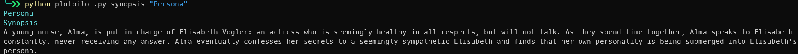

# PlotPilot

A command-line tool to explore movie and series data in your terminal. Fetch synopses, episode summaries, ratings, and visualize series rating distributions with ease.

# PlotPilot

PlotPilot is a terminal-based tool to explore movie and TV series data using the OMDb API. It displays detailed information, episode summaries, and visualizes ratings—all in your terminal, with optional poster images (buggy and im tired).

## Features

-   **Search** for movies or series by title and view details with poster (if supported)
-   **Show full synopsis** for a movie or series
-   **List episodes** with summaries and ratings for a season
-   **Visualize episode ratings** for a season or all seasons

## Requirements

-   Python 3.7+
-   OMDb API key (get one at [omdbapi.com/apikey.aspx](https://www.omdbapi.com/apikey.aspx))
-   Install dependencies:

    ```sh
    pip install -r requirements.txt
    ```

## Setup

1. Create a `.env` file with your OMDb API key:

    ```env
    OMDB_API_KEY=your_api_key_here
    ```

2. Run commands from your terminal:

## Usage

### Search for a movie or series

```sh
python plotpilot.py search "Inception"
```


### Show full synopsis

```sh
python plotpilot.py synopsis "Inception"
```




### List episodes for a season

```sh
python plotpilot.py episodes "Breaking Bad" --season 1
```


### Visualize ratings for all seasons

```sh
python plotpilot.py ratings "Breaking Bad"
```


